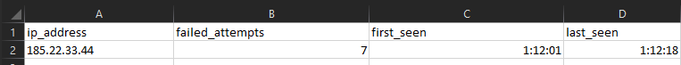
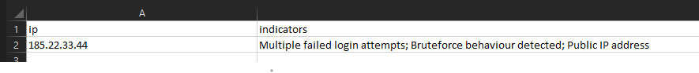
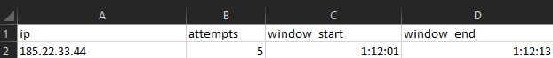

# Linux Authentication Log Analyzer  
Brute Force Detection & Login Investigation (DFIR Project)

## 📌 Overview

This project analyzes Linux authentication logs to identify suspicious login activity, brute-force attempts, and abnormal authentication behavior.

Designed to simulate how SOC and DFIR teams triage login-related security alerts.

---

## 🧪 Simulated Incident

A Linux server experiences repeated login failures and abnormal authentication spikes from external sources.

The tool processes auth logs to identify malicious patterns and reconstruct the attack activity.

---

## 🔎 Investigation Workflow

1. Auth log ingestion  
2. Failed login aggregation by IP  
3. Brute-force detection  
4. Time-based spike analysis  
5. Suspicious IP classification  
6. Evidence export  
7. Incident summary generation  

---

## 📊 Extracted Evidence

### Brute Force Activity


### Suspicious IP Classification


### Failed Attempts


### Time Spike


---

## 📁 Project Structure
```
linux-auth-log-analyzer/
│
├── core/
│   └── main.py
│
├── modules/
│   ├── parser.py
│   ├── failed_logins.py
│   ├── brute_force.py
│   ├── time_spike.py
│   ├── suspicious_ip.py
│   ├── evidence_exporter.py
│   └── report_generator.py
│
├── evidence_data/
│   ├── failed_attempts.csv
│   ├── bruteforce_ips.csv
│   ├── time_spike_events.csv
│   └── suspicious_ips.csv
│
├── logs/
│   └── sample_auth.log
│
├── reports/
│   └── incident_report.txt
│
|
├── screenshots/
│   ├── bruteforce_ip_evidence.png
│   ├── failed_attempts_evidence.png
│   ├── suspecious_ip_evidance.png
│   ├── timespike_evidence.png
|
├── LICENSE
└── README.md

---

## 🧠 Detection Logic

- High volume login failures flagged  
- Time-window anomaly detection applied  
- Behavioral indicators combined to classify suspicious IPs  

---

## 🗂️ MITRE ATT&CK Mapping

- Brute Force → T1110  
- Valid Accounts Abuse → T1078  

---

## 🔎 Analyst Notes

- Repeated authentication attempts from specific IP clusters indicate automated brute-force activity  
- Time-based spikes align with credential guessing patterns  
- Evidence supports credential access attempt scenario  

---

## ▶️ How to Run

```bash
python -m core.main
```

---

## 📁 Output

- failed login summaries  
- suspicious IP datasets  
- incident report  

Stored in:
- `evidence_data/`
- `reports/`

---

## 🎯 Objective

Demonstrate authentication log triage, brute-force detection, and DFIR-style investigation workflow.
